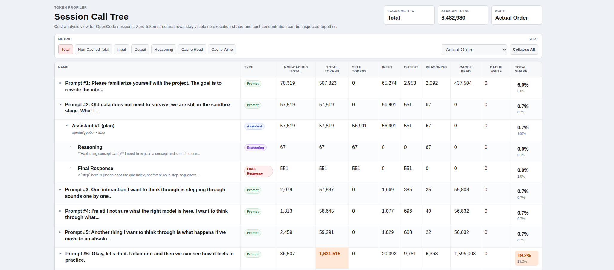

# OpenCode Token Profiler

Profiler-style call tree for inspecting token usage in OpenCode session exports.

[Live Demo](https://oc-token-profiler.vercel.app)



## What It Does

- Upload JSON produced by `opencode export`
- Reconstruct the session into a call tree
- Sort by total, non-cached, input, output, reasoning, and cache tokens
- Highlight hot paths and expensive nodes

## Run

```bash
npm install
npm run dev
```

For a production build:

```bash
npm run build
npm run preview
```

## Use

1. Open the app.
2. Run `opencode export > messages.json`.
3. Click `Upload export JSON`.
4. Pick the exported JSON file.

## Format

The app expects the JSON shape produced by `opencode export`, where the session is wrapped like this:

```json
{
  "info": { "...": "session metadata" },
  "messages": [
    { "info": { "...": "message metadata" }, "parts": [] }
  ]
}
```
